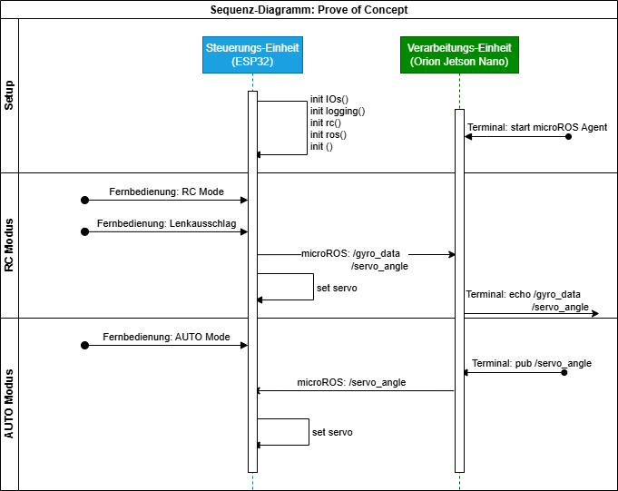

# Study-project: Truck Bridge
## Projectdescription
This project handels the communication between external control-commands from ros2 or rc-controller.  
Components:

    - ESP32
    - Servo
    - Gyro sensor
    - RC-module
    - Status-leds

Breadboard setup:


Sequence diagram for POC:




## Known Issues
### Fix CH340 driver issues
Problem: Fehlermeldung beim Hochladen auf den MCU: "ERROR 2: Cannont access  '/dev/tty/USB0': No such file or directory"

Ursache: Auf dem Jetson Board wir der CH340 USB Treiber nicht richtig installiert. Siehe [link](https://learn.sparkfun.com/tutorials/how-to-install-ch340-drivers/all)

Fix: 

Vorbereitung: Treiber herunterladen: https://cdn.sparkfun.com/assets/learn_tutorials/8/4/4/CH341SER_LINUX.ZIP

```cd into the directory where the files are saved
make clean
make
sudo make load
sudo rmmod ch341
lsmod | grep ch34
```
Gerät neu einstecken
```
dmesg
```
Output sollte "ch34x" anzeigen

### well known Bugs
- Semaphore-blocking when updating ROS status leds

