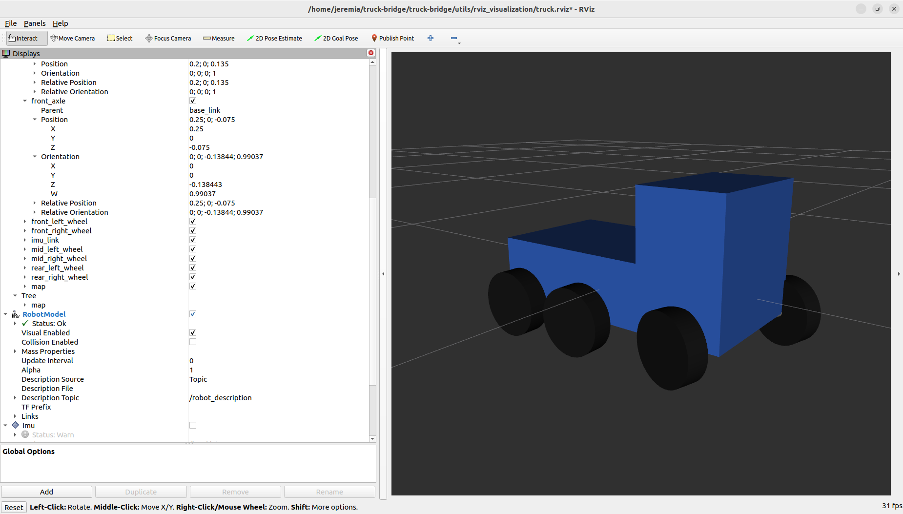

# Study-Project: Truck Bridge

## Project Overview

This study project is part of a research initiative at Hochschule Esslingen under Prof. Dr. Thomas Rothermel, aimed at developing an autonomous model articulated lorry (tractor-trailer combination). The overall research goal is to enable the vehicle to independently perform reverse parking maneuvers. This is achieved through local control algorithms that determine steering and motor commands based on sensor fusion data from cameras, wheel speed sensors, and IMUs.

As a subproject of this larger initiative, this study project focuses on developing the communication platform for the truck. This includes conceptualizing the system architecture and communication interfaces, as well as implementing and testing these concepts in a proof-of-concept demonstration setup.

## Components:

| Component | Function | Role in POC |
|---|---|---|
| NVIDIA Jetson Orin Nano | Processing unit | Dev-Machine. Provides the ROS agent. RViz simulation.|
| NodeMCU ESP32-C | Control unit | Central communication interface.|
| Bosch Sensortec BMI270 | UMI sensor | Provides sensor data to ROS (Publisher).|
| D-Power DS-570BB MG | Servo actuator | Applies received ROS steering commands (Subscriber).|
| ExpressLRS ER6 + Remote| Radio receiver | Manual control. Mode switching.|
| LEDs | Status LEDs | Communication status indication.|

## Breadboard setup:
*Displaying purpose only! Actual pinout can be found in [config.h](include/config.h)*


---


## Quick Start Guide
The main entry point for the development is the Jetson Board. The simplest way to get started is to use ssh to connect to the board. All necessary tools e.g. ROS2, micro-ROS, Rviz, ESP32 driver etc. should be installed and configured on the Jetson. The ESP32 can be programmed via USB using PlatformIO in VS Code within the Jetson board.

### 0) Prerequisites
- install Extensions (if not done):
    - PlatformIO IDE
    - ROS Extension
- connect hardware:
    - ESP32 to Jetson via USB
    - Optional: Logging Interface
    - Power the Breadboard-Power-Module 
    - Power the Jetson Board


### 1) Build and flash firmware (PlatformIO)

1. Connect USB (ESP32)
2. Open the PlatformIO project in VS Code
3. Start Build/Upload (PlatformIO toolbar)


### 2) Start micro-ROS agent (ROS2 host)

Serial transport (default):

```bash
ros2 run micro_ros_agent micro_ros_agent serial --dev /dev/ttyUSB0 -v6
```
*Note: If no connection is established, try resetting the ESP32 to clear old connections.*


### 3) RViz visualization
Start RViz to visualize the trucks state via the published imu and servo angle topics. Must be run in a desktop environment, not possible via ssh!

```bash
ros2 launch utils/rviz_visualization/truck_viz.launch.py
```




### 4) Control the truck
#### Option 1: RC Controller
- Use the right stick (left/right) of the Radiomaster remote to control the servo angle

#### Option 2: Topics

Control servo: `/servo_angle/cmd` (std_msgs/Int32, 0-180)

```bash
ros2 topic pub /servo_angle/cmd std_msgs/msg/Int32 "{data: 120}"
```

Monitor actual servo position:

```bash
ros2 topic echo /servo_angle/state
```

#### Option 3: Keyboard controller

Start the keyboard controller to control the servo via the keyboard:

```bash
python3 utils/keyboard_servo_controller.py
```

## Alternative: Launch file (Desktop environment)

Instead of starting each component separately, it is also possible to start all terminals simultaneously using the provided launch file (Step 2-4). 
This requires a desktop environment and cannot be done via ssh.

```bash
ros2 launch truck_control.launch.py
```

This will automatically start:
- micro-ROS agent (serial connection) *NOTE: Make sure to reset the ESP32 after launch*
- Keyboard controller
- Topic list monitor
- Echo of `/servo_angle/cmd` topic (commands sent to servo)
- Echo of `/servo_angle/state` topic (actual servo position feedback)
- Echo of `/imu/data` topic
- RViz visualization

---

## Known Issues

### Open Todos
A list of improvements can be found in the [todo.md](todo.md) file. 

### RC-Connection loss when input changes too fast
A common issue with the ExpressLRS RC system is that if the input changes too fast (e.g. quickly moving the stick), the connection can be lost and the receiver starts blinking. 

**Fix:**
In most cases the reconnection is automatically establisehed after a moment.
If not, try to disconnect the main power source and the microcontroller and reconnecting it after a few seconds.


### Fix CH340 driver issues
*Note: Issue should be resolved due to a new ESP32 with a different chipset.*
Problem: Upload error on the MCU: "ERROR 2: Cannont access  '/dev/tty/USB0': N o such file or directory"

Cause: The CH340 USB driver is not installed correctly on the Jetson. See [link](https://learn.sparkfun.com/tutorials/how-to-install-ch340-drivers/all)

**Fix:**

Preparation: Download driver: https://cdn.sparkfun.com/assets/learn_tutorials/8/4/4/CH341SER_LINUX.ZIP

```
cd into the directory where the files are saved
make clean
make
sudo make load
sudo rmmod ch341
lsmod | grep ch34
```
Reconnect the device
```
dmesg
```
Output should show "ch34x"

### Well known bugs
- **Micro-ROS Reconnect issue:** If connection to micro-ROS agent is lost, old session is not properly closed. Manual restart of microcontroller is necessary to reconnect.
- **ER6 Receiver blinking:** In some cases the receiver is blinking and not properly receiving signals. This can be resolved by disconnecting the main power source and the microcontroller an reconnecting it after a few seconds.